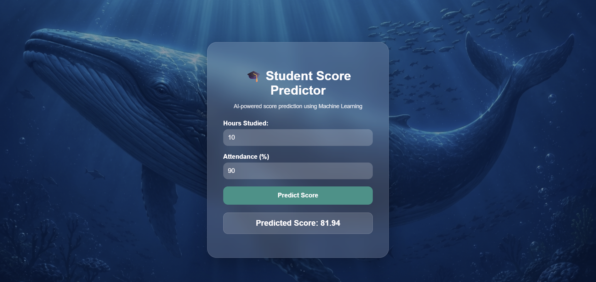

# 🎓 Student Score Predictor

A Machine Learning web application that predicts a student's exam score based on **Hours Studied** and **Attendance (%)** using **Linear Regression**.

Built with **Python, Flask, Scikit-learn**, and deployed live on **PythonAnywhere** with a modern glassmorphism UI and an underwater whale-themed design.

---

## 🌐 Live Demo

**Live Website:** https://safeeek.pythonanywhere.com

**GitHub Repository:** https://github.com/safeekjr/student-score-predictor

---

## 📸 Preview



---

## ✨ Features

* Predicts student scores using a trained Machine Learning model
* Real-time prediction without page reload
* Modern glassmorphism UI
* Whale-themed underwater background
* Responsive design for desktop and mobile
* Input validation for study hours and attendance
* Live deployment on PythonAnywhere

---

## 🛠️ Tech Stack

<row gap=1 wrap=wrap><badge label=Python/><badge label=Flask/><badge label="Scikit-learn"/><badge label=HTML/><badge label=CSS/><badge label=JavaScript/><badge label=Git/><badge label=GitHub/><badge label=PythonAnywhere/></row>

---

## 📂 Project Structure

```text
student-score-predictor/
│
├── app.py
├── model.pkl
├── requirements.txt
├── README.md
├── .gitignore
│
├── static/
│   └── whale.png
│
├── templates/
│   └── index.html
│
└── assets/
    └── project-preview.png
```

---

## 🚀 Run Locally

### 1. Clone the repository

```bash
git clone https://github.com/safeekjr/student-score-predictor.git
cd student-score-predictor
```

### 2. Create a virtual environment

**Windows**

```bash
python -m venv venv
venv\Scripts\activate
```

**Linux / macOS**

```bash
python3 -m venv venv
source venv/bin/activate
```

### 3. Install dependencies

```bash
pip install -r requirements.txt
```

### 4. Run the application

```bash
python app.py
```

Open:

```text
http://127.0.0.1:5000
```

---

## 🧠 How It Works

The application uses a **Linear Regression** model trained with **Scikit-learn**.

### Inputs

* Hours Studied
* Attendance (%)

### Output

* Predicted Student Score

The Flask backend receives the user inputs, sends them to the trained model (`model.pkl`), and instantly returns the predicted score to the webpage.

---

## 🎯 What I Learned

Through this project, I learned how to:

* Build a Machine Learning model with Scikit-learn
* Develop a Flask web application
* Connect a frontend with a Python backend
* Use Git and GitHub for version control
* Deploy a live ML application on PythonAnywhere
* Design a responsive UI with HTML, CSS, and JavaScript

---

## 👨‍💻 Author

**Safeek**

* GitHub: https://github.com/safeekjr

---

⭐ If you like this project, consider giving it a star on GitHub.
